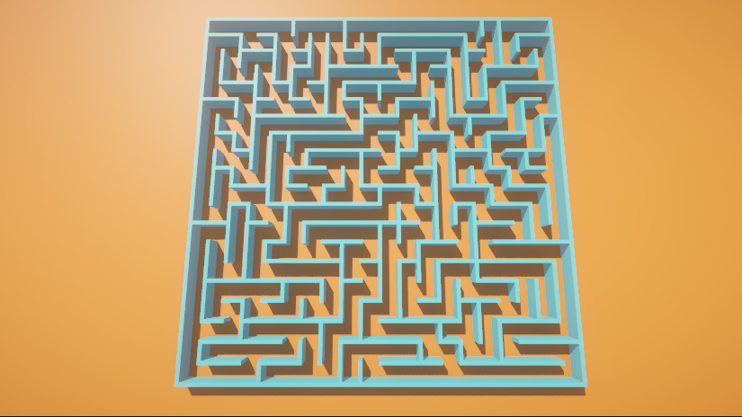
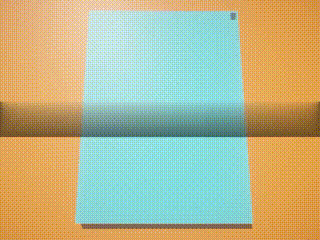

# Maze Generator

This project is a maze generator implemented in Unity using C#.

## Overview

The maze generator creates a random maze using a depth-first search algorithm. It consists of two script files:

- `MazeCell.cs`: Defines the properties and behaviors of individual cells in the maze.
- `MazeGenerator.cs`: Implements the maze generation logic using depth-first search.

## How to Use

1. Open the project in Unity.
2. Press the "Play" button to generate a random maze.
3. Observe the maze generation process.

**Note:** To instantly generate the maze without observation, modify the `Start` and `GenerateMaze` functions in `MazeGenerator.cs` as described in the comments.

## MazeCell Script

### Properties:

- `leftWall`, `rightWall`, `frontWall`, `backWall`: GameObjects representing walls in different directions.
- `unvisitedBlock`: GameObject representing the unvisited state of the cell.

### Methods:

- `Visit()`: Marks the cell as visited and hides the unvisited block.
- `ClearLeftWall()`, `ClearRightWall()`, `ClearFrontWall()`, `ClearBackWall()`: Clears walls in different directions.

## MazeGenerator Script

### Serialized Fields:

- `mazeCellPrefab`: Prefab of the maze cell.
- `mazeWidth`, `mazeDepth`: Dimensions of the maze grid.

### Methods:

- `Start()`: Initializes the maze grid and starts the maze generation coroutine.
- `GenerateMaze(MazeCell previousCell, MazeCell currentCell)`: Recursive coroutine for generating the maze.
- `GetNextUnvisitedCell(MazeCell currentCell)`: Returns a random unvisited neighboring cell.
- `GetUnvisitedCells(MazeCell currentCell)`: Returns a collection of unvisited neighboring cells.
- `ClearWalls(MazeCell previousCell, MazeCell currentCell)`: Clears walls between two connected cells.

## How to Customize

Feel free to explore and customize the code based on your preferences. You can adjust maze dimensions, wall appearance, or even integrate it into a larger project.

